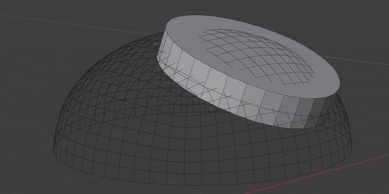
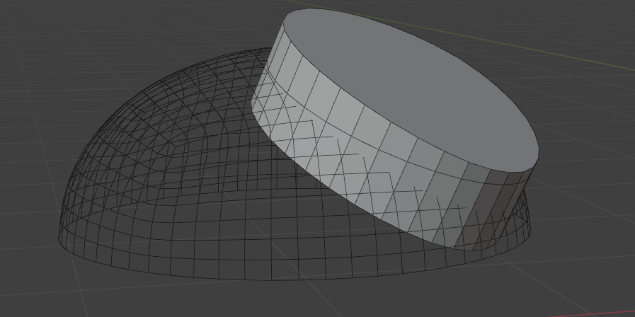
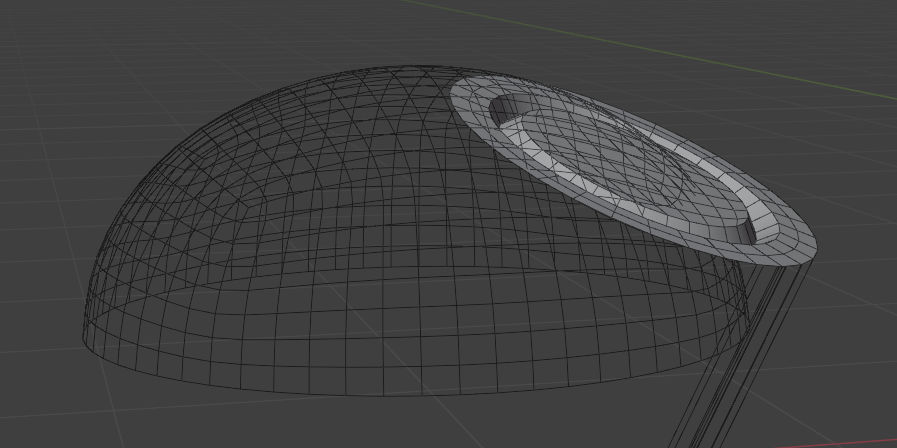

# Surface Insert

Seamlessly join **insert meshes** into a mesh's surface.  
An **insert mesh** can be thought of as a "decal", "patch" or "plug".

There are two primary ways of performing the insert operation:

- 
**Wrap to Surface**  
Warp geometry to match the underlying surface.
- 
**Blend to Surface**  
Keep world position of geometry and blend to surface via masking. This allows you to keep flat surfaces inside the insert mesh.

The **Surface Insert** Modifier performs the following steps:

1. Insert meshes are projected to surface geometry using one of the above methods.
- Normals, materials and UVs are transferred from the original surface to the insert meshes.
- The surface is cut and removed where insert mesh open edges are.
- Vertices are matched on both sides of the seam and welded.

!!! info "Mesh Islands"
    Insert meshes are performed per mesh island. Only mesh islands with open edges will be cut and welded into the original surface.

    - Manifold (solid) mesh islands can be projected but won't affect the underlying surface geometry.
    - Mesh islands that miss a raycast will be skipped entirely and a warning will show on the modifier.

## Requirements

1. A receiving mesh object. This will have the modifier on it.
2. An insert mesh with open edges. This will be projected, cut and welded into the surface of the receiving mesh.
3. Insert mesh cannot partially cut into surface, it has to be fully surrounded.

## Options

### Insert Meshes
This section specifies which meshes to insert

- **Objects/Collection.** Choose individual mesh objects or a collection containing mesh objects
- **Object Count.** How many mesh objects to insert (when in ***Objects*** mode)

### Insert Mesh Projection

- **Method.** How to project the insert meshes to the underlying surface
    - **Wrap to Surface.** Warp geometry to match the underlying surface.
    - **Blend with Surface.** Warp geometry to match the underlying surface.

- **Projection Direction.** Which direction to project insert mesh(es)
    - **Mesh Island Normal.** Use average mesh island normal
    - **Insert Direction.** Specify a direction in the space of each insert object
    - **Object Direction.** Specify a direction in the space of receiving object

- **Projection Origin.** Where to use as the origin of the insert object. This will affect how the objects height is calculated for re-projection.

- **Height Offset.** Offsets insert mesh away from surface by a specified height.

- **Ray Length.** Maximum distance an insert mesh can have an effect.

#### Projection Masking
This section controls masking the projection of insert meshes to the surface. This is most useful when using ***Blend with Surface***.

Controlling falloff is covered [here](../common_settings.md#mask-falloff)

#### Normals
This section controls how much of the surface normals are transferred to the insert mesh. This is most useful when using ***Blend with Surface***.

- **Normal Masking**
    - **Projection Mask**. Use the same mask falloff as the projection
    - **New Mask**. Create a new mask for normals

- **Recalculate Blend Normals.** Only available when using **Blend with Surface**. This will recalculate the normals on the blended portion of the insert mesh before transferring any from the surface.
- **Match Boundary Normals.** When choosing ***New Mask*** this will make sure the boundary edge of the insert mesh matches the normals on the underlying surface. Turn off to create a hard edge.

If ***New Mask*** is chosen, the settings for the falloff will appear below. Controlling falloff is covered [here](../common_settings.md#mask-falloff)

### Surface Boolean
This section controls how the surface is cut for the insert mesh.

- **Weld Surface.** Welds vertices between the surface and insert mesh. Turning this off will leave them as separate mesh islands.
- **Weld Distance.** Distance at which to weld vertices, this takes effect at several points during the process, not just the final weld between surface and insert mesh.
- **Boolean Extrusion.** How far to extrude the cutter shape from the surface. You might need to increase this value if the insert mesh covers a large area of curvature. You can preview cutters in the [Debug](#debug) panel.
    
- **Boolean Offset.** Offset the Boolean cutter outside the surface. This only effects the "top" of the cutter and will also help when an insert mesh covers a large area of curvature. You can preview cutters in the [Debug](#debug) panel.
- **Non-Manifold Solver.** Which boolean solver to use when surface mesh is not manifold. Keep this as ***Float*** for most situations.
    - **Float.** Faster and in a lot of cases more accurate when matching surface points.
    - **Exact.** Much slower and rarely better. Included "just in case" it helps in rare cases.

### Materials
This section controls how materials and UVs are transferred from the surface to the insert meshes

- **Transfer Surface Material.** How to transfer materials from the surface to the insert mesh.
    - **None.** Don't transfer any materials.
    - **Boundary Material.** Transfer the material island(s) that touch open edges.
    - **All.** Overwrite all insert mesh materials with those on the surface.

- **Transfer Material UVs.** Transfer UV Maps for the transferred materials.
- **UV Map.** Which UV map to transfer.

### Debug
This section lets you inspect certain points along the process if the modifier isn't behaving as expected.

- **View.** Outputs geometry from different points in the node graph.

    !!! warning
        This changes the output of the graph, make sure to turn off when done inspecting.
    - **None.** Output standard result, no debugging.
    - **Boolean Cutters.** Output the shapes used to cut the surface.
    - **Skipped Insert Islands.** Output any mesh islands that did not project due to missed ray casts.

- 
Debug Cutters
- 
Debug Skipped Insert Islands

